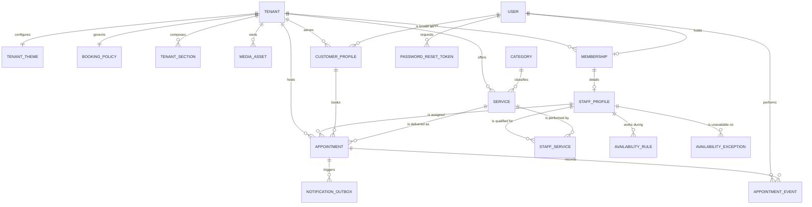
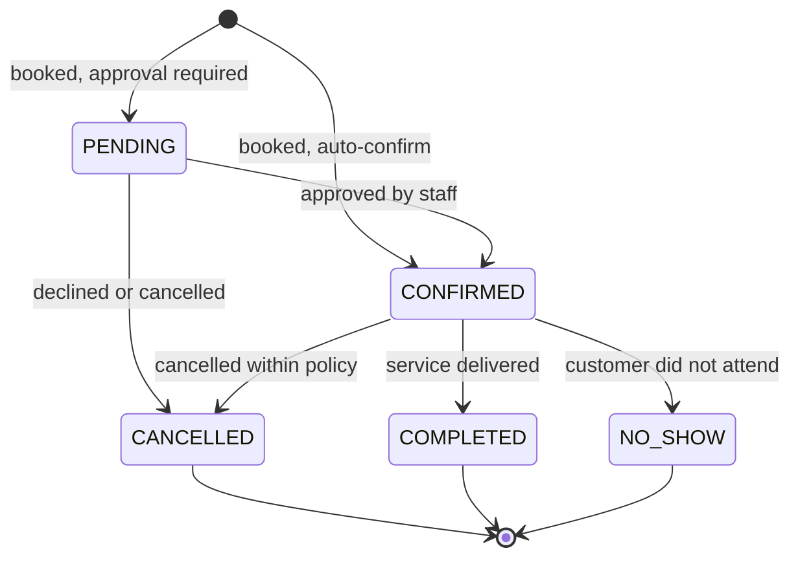

# System Analysis

**Project:** Parlour Booking System
**Phase:** 2, System Analysis
**Document status:** In progress. Awaiting resolution of OPD-08 to OPD-10
**Version:** 0.9
**Last updated:** 31 July 2026

---

## 0. Purpose and Boundary

Phase 1 established what the system must do. Phase 2 establishes what the
system **is**: the actors and their goals, the concepts the system
manipulates, the relationships between those concepts, and the rules that
must hold true at all times.

**Phase 2 is conceptual. Phase 3 is technical.**

This phase does not decide folder structure, API routes, Prisma syntax,
indexes or component hierarchy. It decides that an Appointment exists, that
it has exactly one Staff Member, that its status may move from CONFIRMED to
COMPLETED but never from CANCELLED to COMPLETED, and that its price is frozen
at the moment of booking.

The value of holding this boundary is that analysis artifacts survive
technology changes. If Prisma were replaced with TypeORM tomorrow, every
artifact in this document would remain valid.

### Deliverables

```
1   Actor model, finalised
2   Use case model
3   Use case specifications
4   Domain model
5   Entity relationship diagram
6   Data dictionary
7   Appointment lifecycle state model
8   Availability computation model
9   Business rules catalogue
10  Requirements traceability matrix
```

---

## 1. Actor Model

| ID | Actor | Scope | Authentication | Notes |
|---|---|---|---|---|
| ACT-01 | Guest | Single tenant site | None | Any unauthenticated visitor |
| ACT-02 | Customer | Global identity, tenant-scoped data | Required | May hold relationships with several tenants |
| ACT-03 | Staff Member | Exactly one tenant | Required | Per OPD-04 |
| ACT-04 | Owner | Exactly one tenant | Required | Capability superset of ACT-03 within own tenant |
| ACT-05 | Platform Administrator | All tenants | Required | Operator of the platform |
| ACT-06 | Scheduler | System internal | Not applicable | Time-triggered actor for reminder dispatch |

ACT-06 is a legitimate actor because a time-triggered process initiates
behaviour without human input. FR-037 requires reminders at a configurable
interval before appointment start, and something must initiate that. Naming
it here prevents it from being discovered later as an unowned requirement.

---

## 2. Use Case Model

### 2.1 Subsystem decomposition

Thirty-five use cases is too many to reason about as a flat list. They are
grouped into six subsystems. This grouping is not cosmetic: it becomes the
module boundary in Phase 3 and the folder structure in Phase 4.

```
S1   Identity and Access
S2   Tenant and Site Management
S3   Catalogue Management
S4   Staff and Availability
S5   Booking
S6   Reporting and Notification
```

### 2.2 Use case catalogue

```
+--------------------------------------------------------+
|                                                        |
|  S1 IDENTITY AND ACCESS                                |
|    UC-01  Register customer account                    |
|    UC-02  Authenticate                                 |
|    UC-03  Reset password                               |
|    UC-04  Manage own profile                           |
|                                                        |
|  S2 TENANT AND SITE MANAGEMENT                         |
|    UC-05  Provision tenant                             |
|    UC-06  Suspend or reactivate tenant                 |
|    UC-07  Configure site theme                         |
|    UC-08  Manage site section content                  |
|    UC-09  Toggle section visibility                    |
|    UC-10  Preview unpublished site                     |
|    UC-11  Publish site changes                         |
|    UC-12  Browse public parlour site                   |
|                                                        |
|  S3 CATALOGUE MANAGEMENT                               |
|    UC-13  Manage global service categories             |
|    UC-14  Create service                               |
|    UC-15  Update service                               |
|    UC-16  Deactivate service                           |
|    UC-17  Browse service catalogue                     |
|                                                        |
|  S4 STAFF AND AVAILABILITY                             |
|    UC-18  Create staff record                          |
|    UC-19  Assign services to staff                     |
|    UC-20  Define recurring availability                |
|    UC-21  Record availability exception                |
|    UC-22  Deactivate staff member                      |
|    UC-23  View staff profiles                          |
|                                                        |
|  S5 BOOKING                                            |
|    UC-24  Search available slots                       |
|    UC-25  Book appointment                             |
|    UC-26  Book appointment on behalf of customer       |
|    UC-27  Reschedule appointment                       |
|    UC-28  Cancel appointment                           |
|    UC-29  Complete or mark appointment as no-show      |
|    UC-30  View own appointments                        |
|    UC-31  View tenant schedule                         |
|    UC-32  Configure booking policy                     |
|                                                        |
|  S6 REPORTING AND NOTIFICATION                         |
|    UC-33  Dispatch transactional notification          |
|    UC-34  Dispatch appointment reminder                |
|    UC-35  View operational report                      |
|                                                        |
+--------------------------------------------------------+
```

### 2.3 Actor to use case association

```
Guest ................ UC-01, UC-12, UC-17, UC-23, UC-24
Customer ............. UC-02, UC-03, UC-04, UC-12, UC-17, UC-23,
                       UC-24, UC-25, UC-27, UC-28, UC-30
Staff ................ UC-02, UC-03, UC-04, UC-20, UC-21, UC-24,
                       UC-26, UC-27, UC-28, UC-29, UC-31
Owner ................ all Staff use cases, plus UC-07 to UC-11,
                       UC-14, UC-15, UC-16, UC-18, UC-19, UC-22,
                       UC-32, UC-35
Platform Admin ....... UC-05, UC-06, UC-13
Scheduler ............ UC-34
```

### 2.4 Use case relationships

```
UC-25 <<includes>> UC-24     Booking requires slot search
UC-25 <<includes>> UC-33     Booking triggers confirmation
UC-26 <<extends>>  UC-25     Staff-initiated variant
UC-27 <<includes>> UC-24     Reschedule requires slot search
UC-27 <<includes>> UC-33
UC-28 <<includes>> UC-33
UC-11 <<includes>> static regeneration of public pages
```

Two observations worth internalising:

**UC-24 is included by three use cases.** Whenever a behaviour is included by
multiple use cases, it is a component that must be independently implemented
and independently tested. Slot search is not a step inside booking; it is a
service that booking consumes. This is the analysis-level signal that
predicts a design-level module.

**UC-26 extends UC-25 rather than duplicating it.** Staff booking on a
customer's behalf is the same use case with a different initiating actor and
a relaxed precondition. Modelling these as two separate use cases would very
likely have produced two separate booking implementations that drifted apart.
This is exactly the class of duplication NFR-015 exists to prevent, caught
where it costs nothing.

---

## 3. Use Case Specifications

### 3.1 Specification template

```
Use Case ID        Unique identifier
Name               Verb phrase describing the actor's goal
Subsystem          S1 to S6
Primary Actor      The actor who initiates
Secondary Actors   Systems or actors participating but not initiating
Requirements       Traced FR and NFR identifiers
Preconditions      What must be true before this begins
Postconditions     What is true after successful completion
Trigger            The event that starts the use case
Main Flow          Numbered steps of the successful path
Alternate Flows    Numbered variations that still succeed
Exception Flows    Numbered failure paths and their handling
Business Rules     Traced BR identifiers
Open Questions     Anything unresolved
```

### 3.2 UC-24: Search available slots

```
Use Case ID        UC-24
Name               Search available slots
Subsystem          S5 Booking
Primary Actor      Guest, Customer, or Staff
Secondary Actors   None
Requirements       FR-022, FR-023, FR-024, FR-025, NFR-001, NFR-011
Preconditions      A tenant is resolved from the request host.
                   At least one active service exists for the tenant.
                   At least one active staff member is qualified for
                   the requested service.
Postconditions     No system state is modified. This use case is a
                   pure query and has no side effects.
Trigger            Actor selects a service and a target date.

Main Flow
  1. Actor selects an active service.
  2. Actor optionally selects a specific staff member, or selects
     "any available staff".
  3. Actor selects a target date or date range.
  4. System validates that the requested range falls within the
     configured booking horizon.
  5. System determines the candidate staff set: the selected staff
     member, or all active staff qualified for the service.
  6. For each candidate staff member and each date in range, the
     system computes available intervals per section 8.
  7. System discretises available intervals into slots at the
     tenant's configured granularity.
  8. System removes slots that begin before the minimum advance
     notice threshold.
  9. System returns the remaining slots, each expressed in UTC with
     the tenant timezone identifier supplied alongside.

Alternate Flows
  A1. No staff member is qualified for the selected service. System
      returns an empty result with an explanatory code. Use case ends.
  A2. Actor selects "any available staff". System returns the union
      of slots across candidates, recording which staff member would
      serve each slot. Where two staff members are free at the same
      time, the slot is returned once, with the assignment resolved
      at booking time per BR-14.

Exception Flows
  E1. Requested date precedes the current date in the tenant
      timezone. System rejects with a validation error.
  E2. Requested range exceeds the configured booking horizon. System
      rejects with a validation error stating the permitted horizon.
  E3. Referenced service does not exist or is inactive. System
      returns a not-found error without disclosing whether the
      service exists in another tenant.

Business Rules     BR-08, BR-09, BR-10, BR-11, BR-14
Open Questions     Slot granularity source. See OPD-09.
```

**Note on E3.** The phrasing "without disclosing whether the service exists
in another tenant" is a security requirement expressed at analysis level. In
a multi-tenant system a not-found response and a forbidden response leak
different information. Uniform not-found responses across tenant boundaries
prevent an attacker from enumerating which resources exist elsewhere on the
platform. Requirements of this kind are far easier to catch here than in a
security review after launch.

### 3.3 UC-25: Book appointment

```
Use Case ID        UC-25
Name               Book appointment
Subsystem          S5 Booking
Primary Actor      Customer
Secondary Actors   Notification subsystem
Requirements       FR-026, FR-027, FR-028, FR-029, FR-035, FR-038,
                   FR-051, NFR-009
Preconditions      Actor is authenticated.
                   Tenant is resolved and active.
                   Selected service is active.
                   Selected slot was returned by UC-24.
Postconditions     An Appointment exists in CONFIRMED or PENDING
                   status. Price, duration and buffer are frozen at
                   booking-time values. A status history record
                   exists. A confirmation notification is queued.
                   No other appointment overlaps the assigned staff
                   member for the reserved interval.
Trigger            Actor confirms a selected slot.

Main Flow
  1. Actor submits service, staff selection, slot start time and
     optional notes.
  2. System validates the payload against schema.
  3. System verifies the service is active and belongs to the
     resolved tenant.
  4. System resolves the assigned staff member. Where "any staff"
     was selected, assignment follows BR-14.
  5. System verifies the assigned staff member is qualified for the
     service and is active.
  6. System recomputes availability for the requested interval. The
     client-supplied slot is treated as a proposal, never as an
     authority.
  7. System opens a database transaction.
  8. System creates or retrieves the CustomerProfile linking this
     user to this tenant.
  9. System persists the Appointment with the effective price,
     duration and buffer copied from the service record.
 10. System persists the initial status history record.
 11. System enqueues the confirmation notification within the same
     transaction.
 12. System commits the transaction.
 13. System returns the created appointment to the actor.

Alternate Flows
  A1. Tenant booking policy requires approval. Appointment is created
      in PENDING rather than CONFIRMED status and the notification
      states that confirmation is pending. See OPD-08.
  A2. Actor has no existing CustomerProfile for this tenant. One is
      created at step 8. This is the first-visit path.

Exception Flows
  E1. Slot no longer available at step 6. Transaction is not opened.
      System returns a conflict error and instructs the client to
      refresh availability.
  E2. Overlap constraint violated at commit despite step 6 passing.
      This is the concurrent booking case. Transaction rolls back
      and the system returns the same conflict error as E1.
  E3. Slot violates minimum advance notice at time of submission.
      System returns a validation error.
  E4. Assigned staff member is not qualified for the service. System
      returns a validation error.
  E5. Notification enqueue fails. Per FR-038 the booking must still
      succeed. Enqueue is therefore to a durable store within the
      transaction and dispatch occurs separately. Dispatch failure
      never rolls back a booking.

Business Rules     BR-01, BR-02, BR-03, BR-12, BR-13, BR-14, BR-15
Open Questions     Approval requirement. See OPD-08.
```

**Note on steps 6 and 7 with exception flows E1 and E2.** This is the most
important passage in the phase.

Step 6 re-checks availability even though the client selected a slot the
system itself offered. Exception E2 then handles the case where step 6 passed
and the constraint still failed. These serve different purposes.

- Step 6 is a **user experience** measure. It catches the common case where
  the slot was taken minutes ago and produces a clear error before any
  transaction begins.
- E2 is a **correctness** measure. It catches the narrow window where two
  requests both pass step 6 within microseconds of each other, which
  application code cannot prevent by checking harder. Only the database can
  arbitrate that.

FR-027 states the guarantee "shall not rely solely on application-level
validation". Step 6 is the application-level check. E2 is why FR-027 contains
the word "solely".

### 3.3 Remaining specifications

Use case specifications for UC-01 to UC-23 and UC-26 to UC-35 are outstanding
and follow the template in section 3.1. Writing preconditions and alternate
flows is the exercise that surfaces requirements not yet considered; the
artifact is secondary to the act of producing it.

---

## 4. Domain Model

Eighteen entities, grouped by subsystem.

```
S1  IDENTITY
      User                     Global identity. One per person
      Membership               Links User to Tenant as OWNER or STAFF
      CustomerProfile          Links User to Tenant as a customer
      PasswordResetToken       Single-use, time-limited reset token

S2  TENANT AND SITE
      Tenant                   A parlour. The isolation boundary
      TenantTheme              Design tokens and selected template
      TenantSection            One composable block of the public site
      MediaAsset               An uploaded image and its derivatives

S3  CATALOGUE
      Category                 Global. Not tenant-scoped
      Service                  A bookable offering. Tenant-scoped

S4  STAFF AND AVAILABILITY
      StaffProfile             Staff-specific attributes
      StaffService             Capability mapping, Staff to Service
      AvailabilityRule         Recurring weekly working window
      AvailabilityException    Date-specific override

S5  BOOKING
      BookingPolicy            Per-tenant booking constraints
      Appointment              A reserved interval
      AppointmentEvent         Immutable audit of lifecycle changes

S6  NOTIFICATION
      NotificationOutbox       Durable queue of pending dispatches
```

### 4.1 Modelling decisions requiring justification

**Category carries no `tenantId`.** Per OPD-05 categories are global. This
makes Category the sole exception to the platform-wide isolation rule.
Exceptions to security rules are dangerous precisely because they are
exceptions. Record it prominently: when isolation coverage is audited in
Phase 5, this table will otherwise be flagged as a defect and either
investigated wastefully or, worse, "fixed".

**Membership is separate from StaffProfile.** Membership answers "what is
this person's relationship to this tenant". StaffProfile answers "what are
this person's professional attributes". An Owner has a Membership and no
StaffProfile unless they also perform services. Merging them would require
every Owner row to carry null specialisation, null bio and null photograph.
Nullable columns that apply to only one role are a reliable indicator that
two concepts have been conflated.

**CustomerProfile is the mechanism satisfying FR-052.** The Owner of Tenant A
queries CustomerProfile filtered to Tenant A. The underlying User record is
never exposed to a tenant. A customer visiting three parlours has one User
and three CustomerProfiles, and no tenant can observe the other two. The
privacy requirement is not enforced by careful querying; it is enforced by
the shape of the model. This is what it means for a design to be safe by
construction.

**AppointmentEvent is append-only.** FR-034 requires an immutable audit
record. Immutability is a property of how the entity is used, not something
the database enforces by itself, so it is stated at analysis time and
honoured in every service that touches it. No update path and no delete path
is ever written for this entity.

---

## 5. Entity Relationship Diagram



Read the diagram for its shape rather than its detail. Almost every
relationship originates at TENANT. That radial structure is the visual
signature of a correctly isolated multi-tenant model. Any entity added later
that does not trace back to a tenant should be challenged, and if genuinely
global, like Category, it should be a deliberate and documented exception
rather than an accident.

---

## 6. Data Dictionary

Abbreviated to the booking core, where precision matters most. Remaining
entities follow the same pattern and are outstanding work.

### 6.1 APPOINTMENT

| Attribute | Type | Constraints | Notes |
|---|---|---|---|
| id | Identifier | Primary key | |
| tenantId | Identifier | Not null, foreign key, indexed | Isolation key |
| customerProfileId | Identifier | Not null, foreign key | Never references User directly |
| staffProfileId | Identifier | Not null, foreign key | Per ASM-01, exactly one |
| serviceId | Identifier | Not null, foreign key | |
| startAt | Timestamp | Not null, UTC | NFR-011 |
| endAt | Timestamp | Not null, UTC | Derived, then persisted |
| reservedUntil | Timestamp | Not null, UTC | endAt plus buffer |
| status | Enumeration | Not null | See section 7 |
| priceAtBooking | Decimal | Not null | FR-029 |
| durationAtBooking | Integer | Not null, minutes | FR-029 |
| bufferAtBooking | Integer | Not null, minutes | FR-029 |
| source | Enumeration | Not null | ONLINE, PHONE, WALK_IN |
| customerNote | Text | Nullable | Entered by customer |
| internalNote | Text | Nullable | Never visible to customer |
| createdByUserId | Identifier | Not null, foreign key | Distinguishes UC-25 from UC-26 |
| createdAt | Timestamp | Not null, UTC | |
| updatedAt | Timestamp | Not null, UTC | |

**`reservedUntil` is stored separately from `endAt`.** The customer's
appointment ends at `endAt`. The staff member remains occupied until
`reservedUntil`, because cleanup and preparation are part of the delivery
cycle. Overlap detection operates on the interval from `startAt` to
`reservedUntil`, while the customer is only ever shown `endAt`. Conflating
these produces a system that either overbooks staff or shows customers an
inflated service duration.

**`priceAtBooking`, `durationAtBooking` and `bufferAtBooking` are copies, not
references.** When the owner raises the price of a facial from 1,500 to
1,800, every appointment booked before that change must still report 1,500.
Reading the price through a foreign key to Service would silently rewrite
financial history and corrupt every report. This pattern is called a
point-in-time snapshot and applies to any attribute appearing in a financial
or contractual record.

**`createdByUserId` distinguishes UC-25 from UC-26.** When it equals the
customer's own user identifier, the booking was made online by the customer.
When it differs, a staff member entered it. One column captures the entire
difference between the two use cases, which is the concrete payoff of having
modelled UC-26 as an extension rather than as a separate use case.

### 6.2 AVAILABILITY_RULE

| Attribute | Type | Constraints | Notes |
|---|---|---|---|
| id | Identifier | Primary key | |
| tenantId | Identifier | Not null, foreign key, indexed | Denormalised for isolation |
| staffProfileId | Identifier | Not null, foreign key | |
| dayOfWeek | Integer | Not null, 0 to 6 | 0 is Sunday |
| startTime | Local time | Not null | Wall clock, no date |
| endTime | Local time | Not null | Wall clock, no date |
| effectiveFrom | Date | Nullable | Supports future schedule changes |
| effectiveUntil | Date | Nullable | |

`startTime` and `endTime` are local wall-clock times carrying no date and no
timezone. This does not contradict NFR-011. A rule stating "Sunday, 10:00 to
18:00" is a statement about the local clock that remains true regardless of
date. It is converted to UTC only when combined with a specific date during
slot computation. Storing recurring rules as UTC timestamps is a common
beginner error that breaks the moment a rule must survive any change in
offset.

`tenantId` is present despite being derivable through `staffProfileId`. This
denormalisation is deliberate: it permits the isolation enforcement in SRS
section 8.2 to apply uniformly to every tenant-scoped table without requiring
a join, and it makes the row-level security policy trivial to express. Accept
a small amount of redundancy in exchange for a security invariant that holds
without exception.

---

## 7. Appointment Lifecycle State Model



### 7.1 Transition rules

| From | To | Permitted actors | Guard condition |
|---|---|---|---|
| PENDING | CONFIRMED | Staff, Owner | None |
| PENDING | CANCELLED | Customer, Staff, Owner | None |
| CONFIRMED | CANCELLED | Customer | Now is before start minus cancellation cutoff |
| CONFIRMED | CANCELLED | Staff, Owner | None |
| CONFIRMED | COMPLETED | Staff, Owner | Now is after `endAt` |
| CONFIRMED | NO_SHOW | Staff, Owner | Now is after `startAt` |

CANCELLED, COMPLETED and NO_SHOW are terminal. No transition leaves them. Per
NFR-010 no appointment is ever physically deleted, so a terminal state is the
end of the record's lifecycle but not the end of its existence.

### 7.2 Rescheduling is deliberately absent from this diagram

A reschedule is modelled as a mutation of `startAt`, `endAt`, `reservedUntil`
and possibly `staffProfileId` on the existing Appointment, accompanied by an
AppointmentEvent of type RESCHEDULED. The status does not change.

The alternative, cancelling the original and creating a replacement, appears
cleaner but has three defects:

1. It inflates the cancellation rate in every report, making UC-35 output
   meaningless.
2. It breaks the identity of the appointment, so the customer's confirmation
   reference changes for what they experience as a minor adjustment.
3. It requires the replacement to carry a reference back to the original,
   reintroducing the linkage that cancelling was supposed to avoid.

The mutation approach requires that the FR-027 overlap guarantee apply to the
updated interval. A reschedule is a booking for constraint purposes even
though it is an update for lifecycle purposes.

---

## 8. Availability Computation Model

The analytical core of the system, stated as a conceptual algorithm. No
implementation, no library, no syntax.

**Inputs:** `tenantId`, `staffProfileId`, `serviceId`, `targetDate`

### Stage 1: Resolve the working window

Select the AvailabilityRule for the staff member matching the day-of-week of
`targetDate`, where `targetDate` falls within `effectiveFrom` and
`effectiveUntil`. This yields zero or more local time windows. Zero windows
means the staff member does not normally work that day; computation
terminates with an empty result.

### Stage 2: Apply exceptions

Select any AvailabilityException for that staff member on `targetDate`.

| Exception type | Effect |
|---|---|
| `UNAVAILABLE` | Discard all windows. Return empty. Terminate |
| `CUSTOM_HOURS` | Replace stage 1 windows with the exception window |
| None present | Retain stage 1 windows unchanged |

An exception always **overrides** the recurring rule; it is never merged with
it. Merge semantics produce ambiguity that neither developer nor owner will
be able to reason about.

### Stage 3: Convert to UTC and subtract occupied intervals

Combine each local window with `targetDate` and the tenant timezone to
produce absolute UTC intervals. Then subtract every Appointment for that
staff member in status PENDING or CONFIRMED, using the interval from
`startAt` to `reservedUntil`. CANCELLED, COMPLETED and NO_SHOW appointments
do not occupy time. What remains is a set of free intervals.

### Stage 4: Discretise into slots

For each free interval, emit candidate start times at the configured
granularity. A candidate is retained only if the full required duration,
being service duration plus buffer, fits within the free interval from that
start time. Discard candidates violating minimum advance notice per FR-024 or
falling in the past per FR-023.

### 8.1 Worked example

The offset is the point of this example.

```
Tenant timezone       Asia/Kathmandu, UTC+05:45
Target date           2026-08-15
Recurring rule        Saturday, 10:00 to 18:00 local
Exception             None
Service               Facial, 60 minutes, 15 minute buffer
Granularity           15 minutes
Minimum notice        2 hours
Existing appointment  13:00 to 14:00 local, reserved to 14:15

Stage 1   Local window 10:00 to 18:00

Stage 2   Unchanged

Stage 3   Window in UTC     2026-08-15 04:15Z to 12:15Z
          Occupied in UTC   2026-08-15 07:15Z to 08:30Z
          Free intervals    04:15Z to 07:15Z
                            08:30Z to 12:15Z

Stage 4   Required block    75 minutes
          Interval one      Last viable start 06:00Z, since
                            06:00Z plus 75 minutes is 07:15Z
          Slots             04:15Z, 04:30Z, ... 06:00Z
          Interval two      Last viable start 11:00Z
          Slots             08:30Z, 08:45Z, ... 11:00Z
```

Every UTC value falls on an unfamiliar quarter-hour pattern because a 45
minute offset means local hour boundaries do not align to UTC hour
boundaries. Any code assuming a slot begins on a UTC hour or half-hour will
be wrong here. Any test written against a whole-hour timezone will pass while
production fails.

Per RSK-03, write the first availability test cases against Asia/Kathmandu
specifically, not against UTC and not against a whole-hour offset.

### 8.2 The negative requirement

**Bookable slots are never persisted.** They are computed on every request.
Persisted slots would require regeneration whenever a rule, exception,
service duration, buffer or policy changes, and between regenerations they
would be silently incorrect. This restates RSK-01, the highest-impact design
risk in the project.

---

## 9. Business Rules Catalogue

A business rule is an invariant that must hold regardless of which use case
is executing. Rules are stated once here and referenced everywhere, which is
the DRY principle applied to specification rather than to code.

| ID | Rule |
|---|---|
| BR-01 | A staff member shall never be assigned two appointments whose reserved intervals overlap. |
| BR-02 | An appointment shall reference a staff member qualified for the referenced service at the time of booking. |
| BR-03 | An appointment shall reference a service belonging to the same tenant as the appointment. |
| BR-04 | A service shall never be physically deleted while referenced by any appointment. Deactivation only. |
| BR-05 | A staff member shall never be physically deleted. Deactivation only. |
| BR-06 | Deactivating a staff member shall not alter existing appointments. Future appointments require explicit reassignment or cancellation by the owner. |
| BR-07 | A deactivated service shall not appear in the public catalogue and shall not be bookable, but shall remain readable within historical appointments and reports. |
| BR-08 | An availability exception shall override, never merge with, the recurring rule for that date. |
| BR-09 | An appointment shall never begin in the past. |
| BR-10 | An appointment shall satisfy the tenant's minimum advance notice at the time of creation. |
| BR-11 | An appointment shall fall within the tenant's booking horizon at the time of creation. |
| BR-12 | Price, duration and buffer shall be frozen at the values effective when the appointment was created. |
| BR-13 | Every appointment status transition shall produce an immutable event record naming the acting user. |
| BR-14 | Where a customer selects "any available staff", assignment shall be deterministic. The qualified, available staff member with the fewest confirmed appointments on the target date is selected. Ties resolve by lowest staff identifier. |
| BR-15 | A customer shall not hold two confirmed appointments with overlapping intervals within the same tenant. |
| BR-16 | A user shall never read or write data belonging to a tenant with which they hold no membership or customer profile. |
| BR-17 | A tenant shall never observe that a customer holds a relationship with any other tenant. |
| BR-18 | A category shall be global and shall not be modifiable by any tenant. |
| BR-19 | All persisted timestamps shall be UTC. Local time shall be derived at presentation using the tenant timezone. |
| BR-20 | Notification dispatch failure shall never cause a booking transaction to fail or roll back. |

**BR-14** resolves a question the specification left implicit. "Any available
staff" must produce a deterministic assignment, or two identical requests
could produce different outcomes, making the system untestable and support
conversations impossible. Load balancing by same-day appointment count is
chosen over round-robin or random because it distributes work fairly, which
is what the staff themselves will care about.

**BR-15** is a rule likely to have been missed until a customer reported it.
Nothing in the requirements prevented a customer booking a facial and a
manicure with two different staff members at the same time. Whether that is a
defect or a feature is a business question worth putting to a parlour owner.
It is modelled as prohibited because ASM-01 states one customer receives one
service at a time.

---

## 10. Requirements Traceability Matrix

Abbreviated to the booking subsystem. Traceability answers "which test
verifies FR-027" in Phase 5 and "what breaks if I change this" in Phase 6.

| Requirement | Use cases | Entities | Business rules |
|---|---|---|---|
| FR-022 | UC-24 | AvailabilityRule, AvailabilityException, Appointment | BR-08 |
| FR-023 | UC-24 | Appointment | BR-09 |
| FR-024 | UC-24, UC-25 | BookingPolicy | BR-10 |
| FR-025 | UC-24, UC-25 | BookingPolicy | BR-11 |
| FR-026 | UC-25 | Appointment, StaffService | BR-02, BR-14 |
| FR-027 | UC-25, UC-27 | Appointment | BR-01 |
| FR-028 | UC-25, UC-29 | Appointment | BR-13 |
| FR-029 | UC-25 | Appointment, Service | BR-12 |
| FR-030 | UC-28 | Appointment, BookingPolicy | BR-13 |
| FR-031 | UC-27 | Appointment | BR-01, BR-13 |
| FR-032 | UC-26 | Appointment | BR-02, BR-03 |
| FR-033 | UC-29 | Appointment, AppointmentEvent | BR-13 |
| FR-034 | UC-25 to UC-29 | AppointmentEvent | BR-13 |
| FR-038 | UC-33, UC-34 | NotificationOutbox | BR-20 |
| FR-051 | UC-25 | User, CustomerProfile | BR-16 |
| FR-052 | UC-25, UC-35 | CustomerProfile | BR-17 |

Any requirement tracing to no use case is either unimplementable or was never
a requirement. Any use case tracing to no requirement is scope creep. Running
that check across the complete matrix is a worthwhile hour before closing
this phase.

---

## 11. Open Decisions

| ID | Question | Recommendation |
|---|---|---|
| OPD-08 | Does an online booking become CONFIRMED automatically, or enter PENDING awaiting staff approval? | Per-tenant policy flag defaulting to automatic confirmation. Automatic is a materially better customer experience and is what booking platforms have trained people to expect. Some owners will insist on approving every booking, particularly early on when they do not yet trust the system, and a flag costs almost nothing. Note that PENDING appointments must still hold the slot, otherwise approval is meaningless. |
| OPD-09 | Is slot granularity fixed platform-wide at 15 minutes, or configurable per tenant? | Per-tenant field on BookingPolicy defaulting to 15 minutes. A parlour whose shortest service is 45 minutes may prefer 30 minute granularity for a cleaner grid. The field costs one column now and cannot be retrofitted without recomputing every cached availability response later. |
| OPD-10 | When a customer selects "any available staff", is assignment made at booking time or deferred for owner allocation? | Assignment at booking time per BR-14. Deferred assignment sounds flexible but creates a category of problems: unassigned appointments do not participate in overlap detection so FR-027 cannot be guaranteed; the customer cannot be told who will serve them; and the owner acquires a daily allocation task they did not ask for. Assign immediately, permit manual reassignment afterwards. |

---

## 12. Phase Exit Criteria

| Criterion | Status |
|---|---|
| OPD-08 to OPD-10 resolved and recorded | Outstanding |
| Domain model in section 4 reviewed and accepted | Outstanding |
| Use case specifications exist for all thirty-five use cases | Outstanding. UC-24 and UC-25 complete |
| All Phase 2 artifacts committed to `docs/02-analysis/` | Met on commit of this document |
